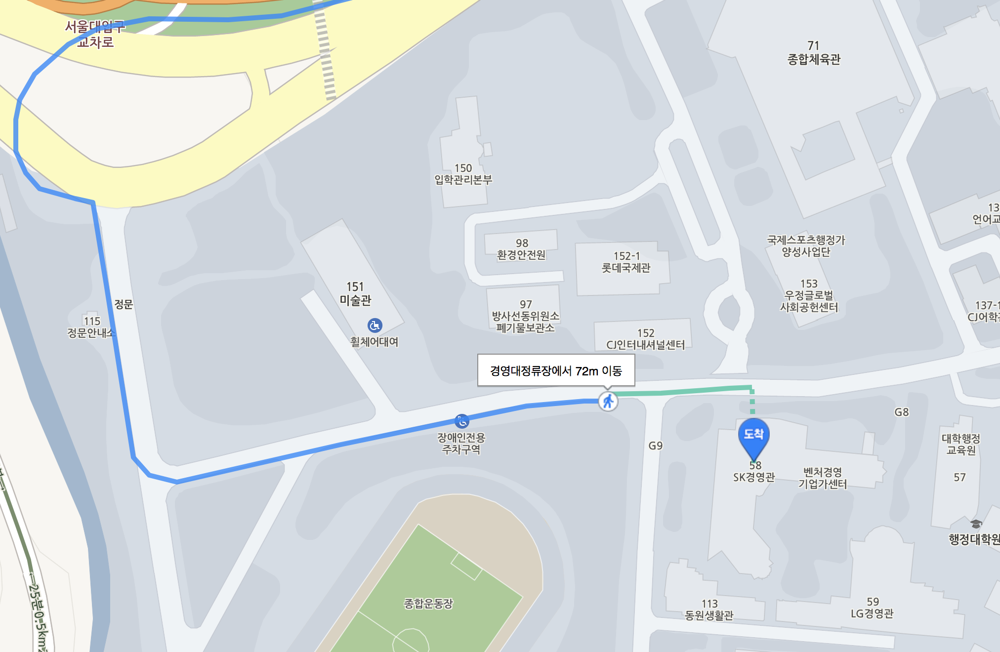
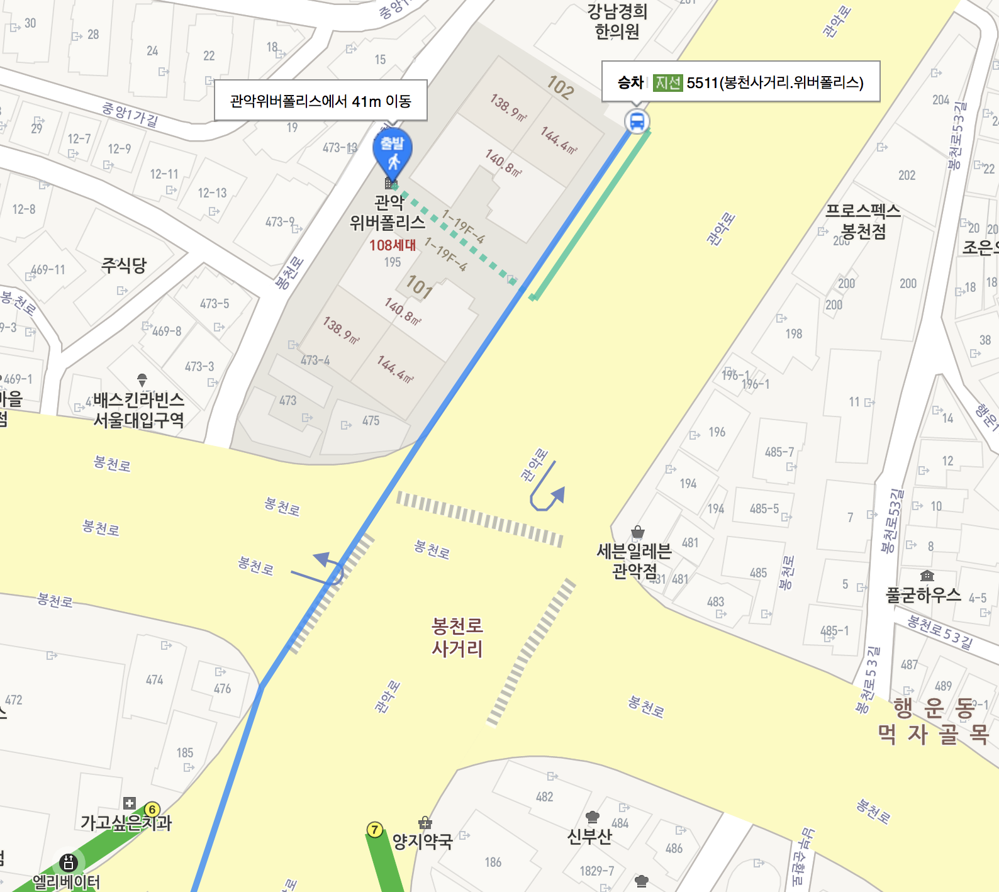
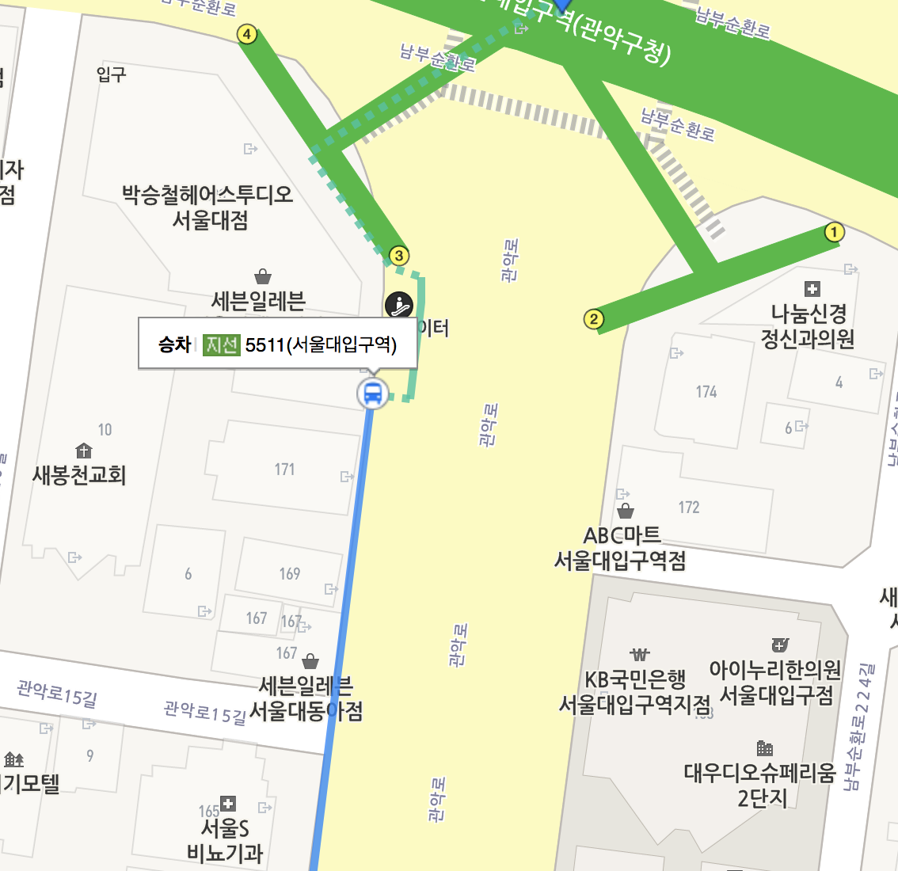
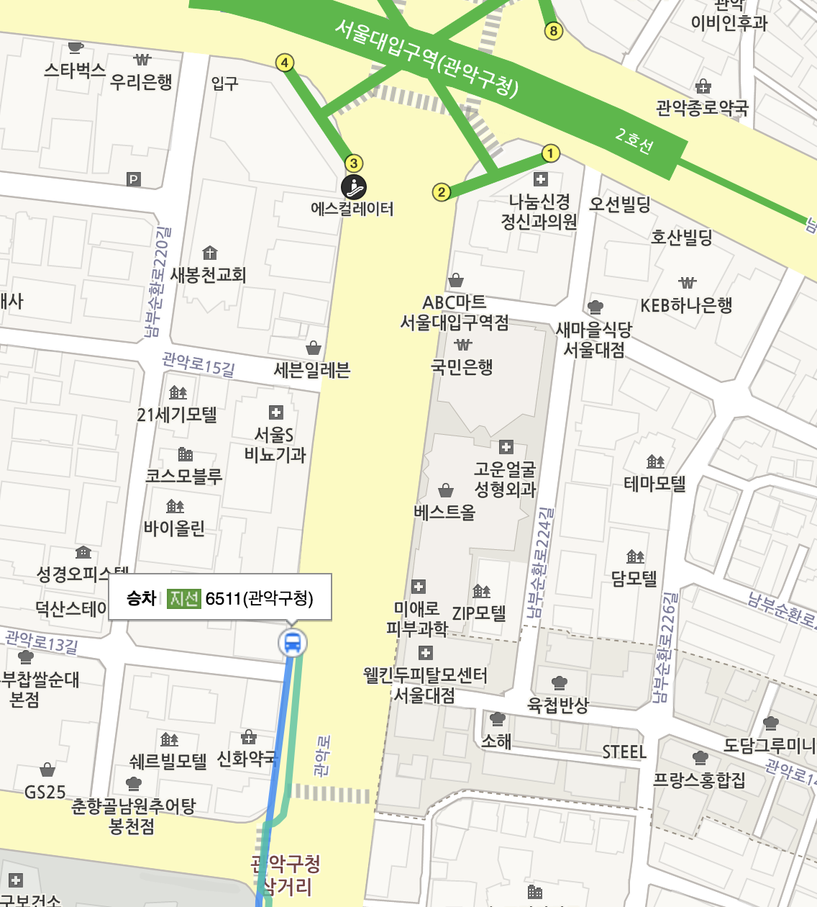
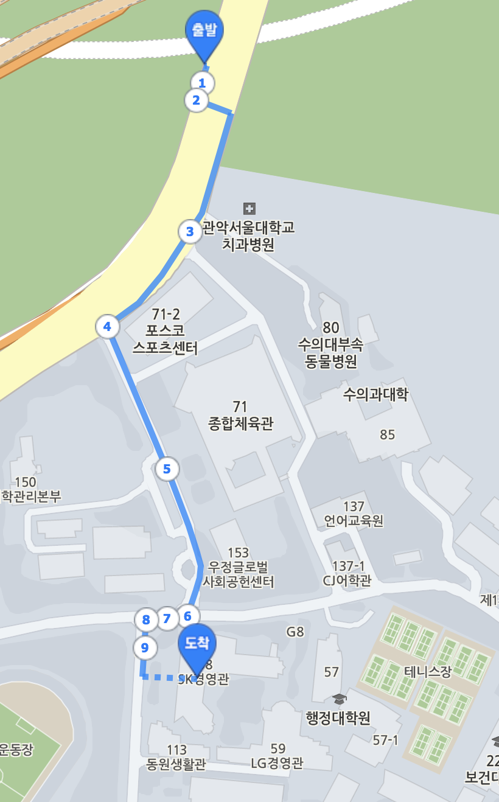

# 4주차 세션: 오픈튜토리얼스 이태호님 특강
> 개발자와 디자이너의 협업에 관하여  
  
  
## 세션 장소  

서울대학교 경영대학 SK관(58동) 2층 217 강의실  

## 일정표   

| 시간            | 내용                           |
|----------------|-------------------------------|
|14:00 ~ 14:30   |출석 체크 및 자유 네트워킹          |
|14:30 ~ 15:30   |이태호님 강연                    |
|15:30 ~ 16:30   |사전 질문답변 / 현장 질문          |
|16:40 ~ 17:50   |팀별 중간 발표                   |
|17:50 ~ 16:00   |정리 및 뒤풀이 장소 이동          |
  

## 오시는 길 

#### 숭실대입구역에서 오는법 
> 편하게 앉아올 수 있음

숭실대입구역 2번 출구로 나와 마을버스 5511 승차 후, 경영대 정류장에서 하차

#### 서울대입구역 6번 출구에서 오는법 
> 여기까지는 운 좋으면 앉아올 수 있음

서울대입구역 6번 출구로 나와 관악 위버폴리스 앞 정류장에서 5511 승차 후, 경영대 정류장에서 하차 

#### 서울대입구역 3번 출구에서 오는법 

1. 3번 출구로 나와서 올리브영 앞 정류장에서 5511 승차 후, 경영대 정류장에서 하차 
> 버스 기다리는 줄 3개가 있는데 3번 출구에서 가장 먼쪽 (세븐일레븐 앞) 정류장이 5511 타는 줄 

##### 참고: 주말에는 관악산 등산객들이 많아 3번 출구 5511은 매우 비추..!

2. 3번 출구로 나와 쭉 걸어가서 CU 앞 버스 정류장에서 5517, 5523 빼고 아무거나 승차 
> 501, 651 750A, 750B, 5528, 6511, 6512, 6515 등 모든 버스 다 타도 됨. 헛갈리면 파란색 버스 타세요!! 

- 두 정거장 지나 서울대학교 치과병원 정류장에서 내려 서울대 SK 경영관까지 5분 걸어오기 

